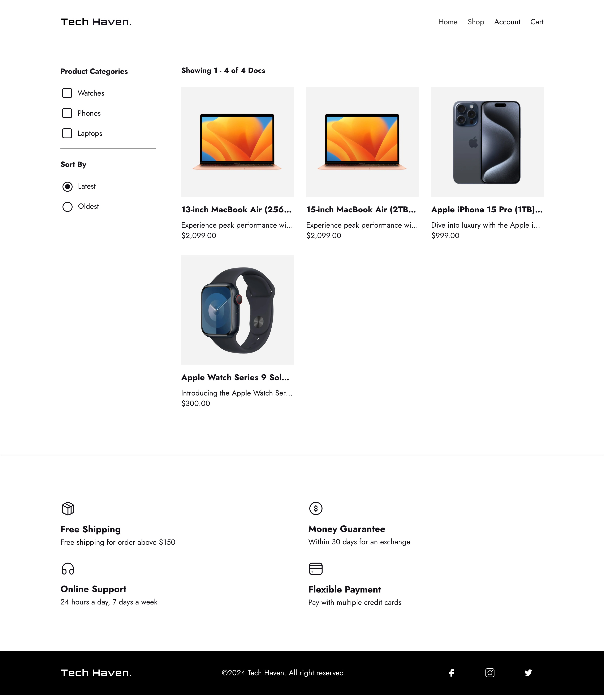
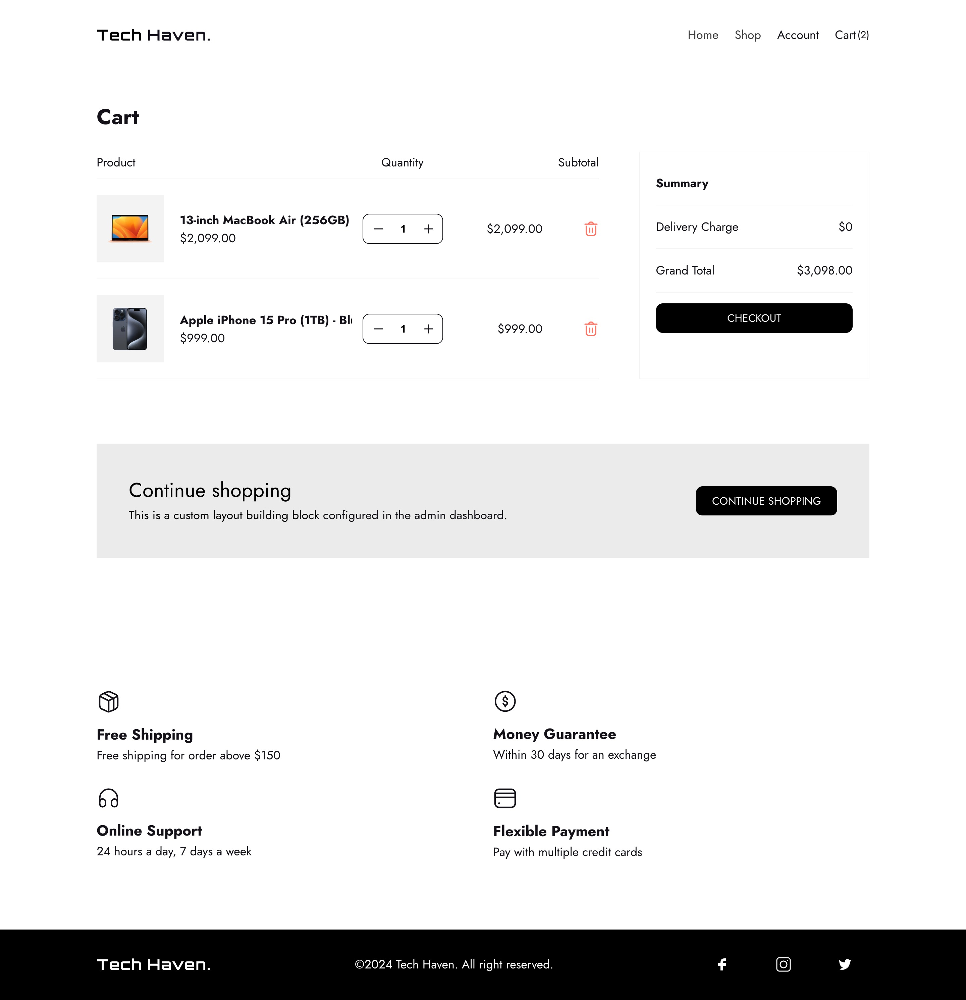
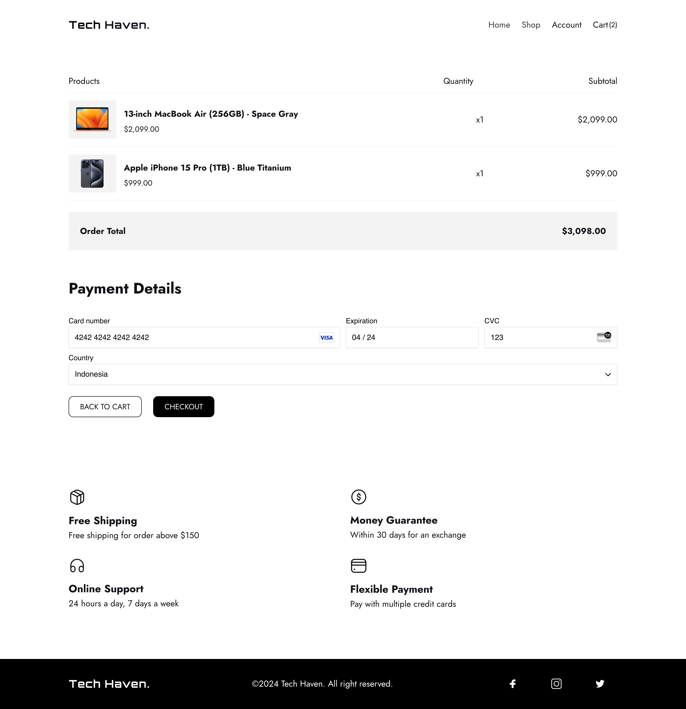
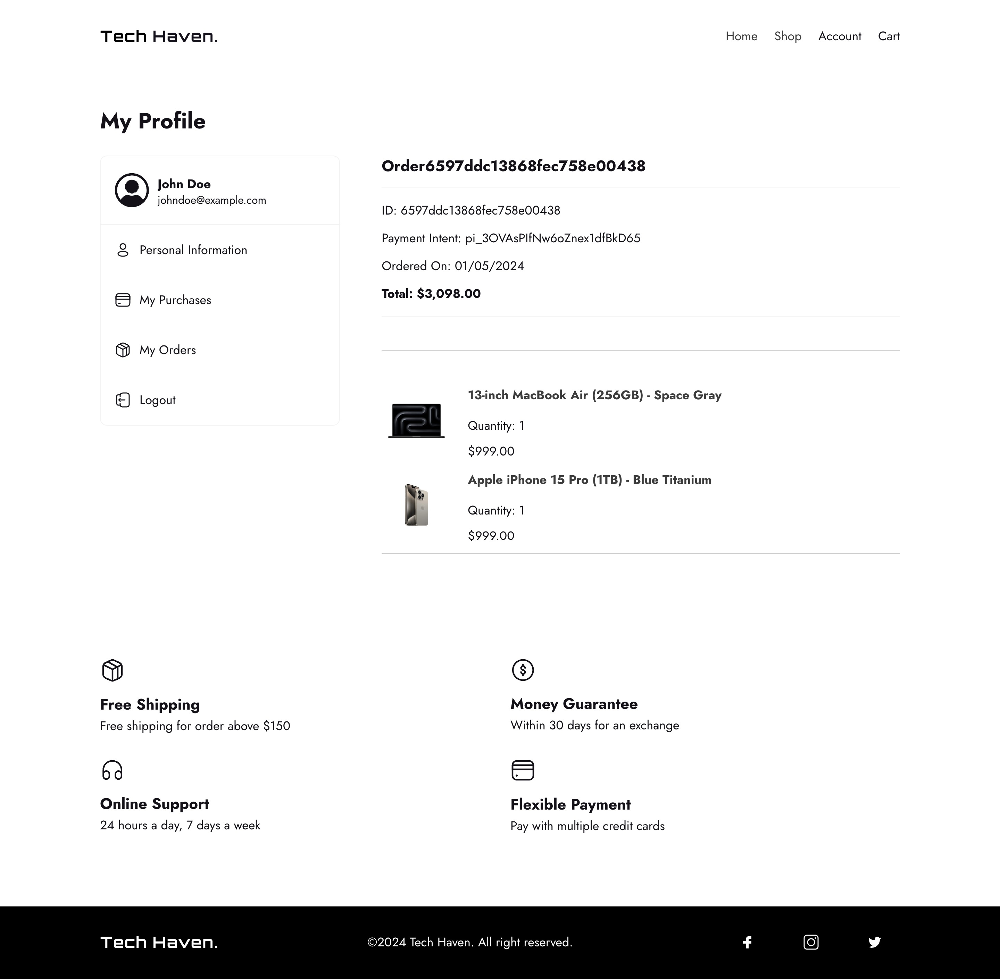

# E-Commerce using PayloadCMS

This is a NextJS E-commerce using PayloadCMS.

Additional features:

- [PayloadCMS](https://github.com/payloadcms/payload) app framework and a headless CMS based on NextJS.
- [Stripe](https://stripe.com/docs) a set of programmable APIs and tools to facilitate payments and pay out.

## Screenshots

## License

This project is under the MIT license.

## Credits

Thanks to:

- [@jsmastery](https://www.jsmastery.pro/) for inspiring project.